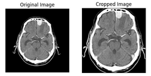
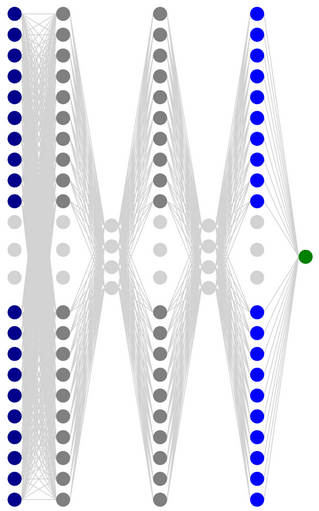

# Brain Tumor Detection using Deep Learning

## Project Overview
The aim of this project is to collect MRI images of the brains of both healthy individuals and those with brain tumors. Using deep learning and Convolutional Neural Networks (CNNs), we seek to identify the presence or absence of brain tumors in these images.

### Data Collection
Neural networks require sufficient data for effective learning. Since a dataset with clear labels and an adequate number of images of brains with tumors or healthy brains did not exist, we aggregated images from available sources and related datasets for this purpose.

The final dataset includes the following categories:
- Healthy individuals
- Individuals with an unspecified tumor
- Individuals with a Glioma tumor
- Individuals with a Meningioma tumor
- Individuals with a Pituitary tumor
- Rotated images using data augmentation

These images have been categorized into four directories and are accessible via [this link](https://drive.google.com/drive/folders/1IXChVne-dqAyy4HN7GykE6vAmUmq6gfu?usp=drive_link) under the title `brain_dataset` with the following distribution:
- train/no -> 1473 images
- train/yes -> 2630 images
- test/no -> 250 images
- test/yes -> 300 images

## Image Preprocessing
To focus on the brain region and eliminate background interference during model training, we implement a function to crop the images. This function processes an image by cropping a rectangular region that includes the important object in the image.

## Convolutional Neural Network
Utilizing Keras, we create a sequential model with two convolutional layers and one fully connected layer. The first convolutional layer applies 32 kernels of size 7x7 to the input image with dimensions 243x243x3. To maintain the image size, we use zero padding of size 3. The output of this layer, after passing through batch normalization and applying the ReLU activation function, will be 224x224x32. After a 4x4 max-pooling layer, a tensor with dimensions 56x56x32 is obtained. The next stage involves another convolutional layer with 32 kernels of size 9x9, followed by batch normalization, ReLU activation, and a 4x4 max-pooling layer, resulting in a tensor of size 12x12x32. Dropout with a rate of 0.25 is applied to the outputs of the max-pooling layers to prevent overfitting.

Next, the generated tensor of size 12x12x32 is flattened into a 4608-dimensional vector and fed into a fully connected network. This network has a hidden layer with 200 neurons, followed by ReLU activation, batch normalization, and dropout with a rate of 0.33. The output layer consists of one neuron with a sigmoid activation function, producing the network's prediction of the probability of 'no tumor' for the input image.

For optimization, we use the Adam optimizer and cross-entropy loss.

## Results
After 25 epochs on the entire dataset with a batch size of 160, the model achieved the following accuracy:
- Training accuracy: 99.0%
- Validation accuracy: 97.5%
- Test accuracy: 93.4%
- F1 score: 0.931

Using the sklearn library, we also calculate the confusion matrix and recall and precision scores.

